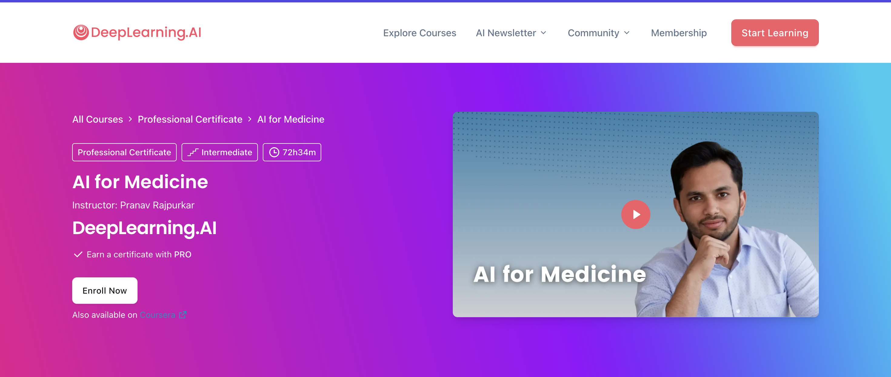

# AI for Medicine Specialization — DeepLearning.AI

Notes, labs, and assignments from the [AI for Medicine Specialization](https://www.deeplearning.ai/courses/ai-for-medicine-specialization/) (DeepLearning.AI, Coursera). Three-course specialization on applying machine learning to medical diagnosis, prognosis, and treatment.

## Courses

### Course 1: AI for Medical Diagnosis
AI-assisted medical diagnosis using 2D and 3D medical image data — multi-class classification and image segmentation.

- **Week 1 — Disease Detection with Computer Vision**: chest X-ray classification, image preprocessing, weighted loss for class imbalance, DenseNet, patient overlap / data leakage.
- **Week 2 — Evaluating Models**: model evaluation metrics, ROC curve and threshold selection.
- **Week 3 — Image Segmentation on MRI Images**: exploring 3D MRI data and labels, sub-section extraction, U-Net model for brain tumor segmentation.

### Course 2: AI for Medical Prognosis
Predicting patients' future health outcomes — linear and nonlinear risk models, decision trees, survival analysis.

- Building risk scores, feature engineering for prognosis.
- Decision trees and random forests for mortality prediction.
- Survival estimation and time-to-event modeling (Kaplan-Meier, Cox proportional hazards).

### Course 3: AI for Medical Treatment
AI-driven treatment recommendations from individual patient health data.

- Treatment effect estimation from randomized control trial data.
- Model interpretation (feature importance, Shapley values).
- NLP for extracting information from radiology reports; question answering with BERT.

## Repository Structure

```
Course1:AI-for-Medical-Diagnosis/
  Week1:Disease-Detection-with-Computer-Vision/
  Week2:EvaluatingModels/
  Week3:Image_Segmentation_on_MRI_Images/
Course2:AI-for-Medical-Prognosis/   (in progress)
Course3:AI-for-Medical-Treatment/   (in progress)
```

Each week folder contains Jupyter notebooks: `Lab_*` notebooks are guided walkthroughs, `Assignment` notebooks are graded programming assignments.

## Source

- [AI for Medicine Specialization — DeepLearning.AI](https://www.deeplearning.ai/courses/ai-for-medicine-specialization/)
- [AI for Medicine Specialization — Coursera](https://www.coursera.org/specializations/ai-for-medicine)
